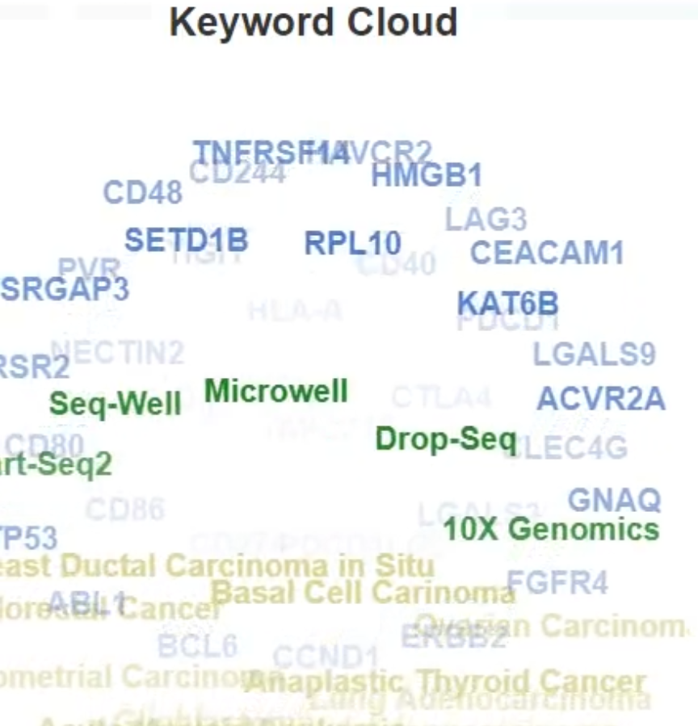

# 如何绘制动态词云图

[BI2021/HQZ/20211114/BioX]

词云图（别称文字云、标签云），一种常用的文本数据可视化方法，在科学可视化中也经常使用；它包括静态、动态样式。

为绘制动态词云图，可以通过在线工具或者Python等编程语言等自己实现。

在线工具有非常多，比如文字云（https://www.wenziyun.cn）、或者WordArt（https://wordart.com/）等。
在Python中可以调用wordcloud库等实现。

**示例截图**

#科学可视化 #词云图 #WordCloud
